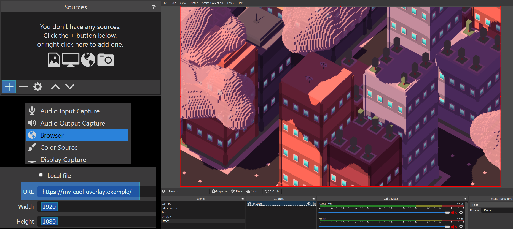

# [Twitch Chat Animations!](https://github.com/moonscreens)
This is a project for creating fun animations that live streamers can use to make their streams a touch more visually appealing and interactive. The concept is simple, use JavaScript to create an animation that connects to Twitch Chat and displays emotes in real time using fun animations.

The end result is a browser source streamers can easilly plug into OBS!

Check out the example code:
- [ThreeJS starter template](https://github.com/moonscreens/intro-example-threejs)
  - Uses the [Three.JS](https://threejs.org/) library
  - More performant than the Canvas template
  - Capable of 2D + 3D scenes
- [Canvas starter template](https://github.com/moonscreens/intro-example)
  - Uses the browsers built in [Canvas API](https://developer.mozilla.org/en-US/docs/Web/API/Canvas_API)
  - Great if you're already familiar with Canvas

[Guidelines](guidelines.md) - Some helpful tips on the technical and visual composition.

https://user-images.githubusercontent.com/12778272/153722392-7afc99f2-be68-41c7-8489-49404ce4647e.mp4

## Who is [moonmoon](https://www.twitch.tv/moonmoon)?

Moonmoon is [a bald streamer on twitch](https://www.twitch.tv/moonmoon) which this entire project was created for. However you can feel free to use the source code here for other streamers and applications.

[Submitting an intro screen to moon.](submitting.md)
